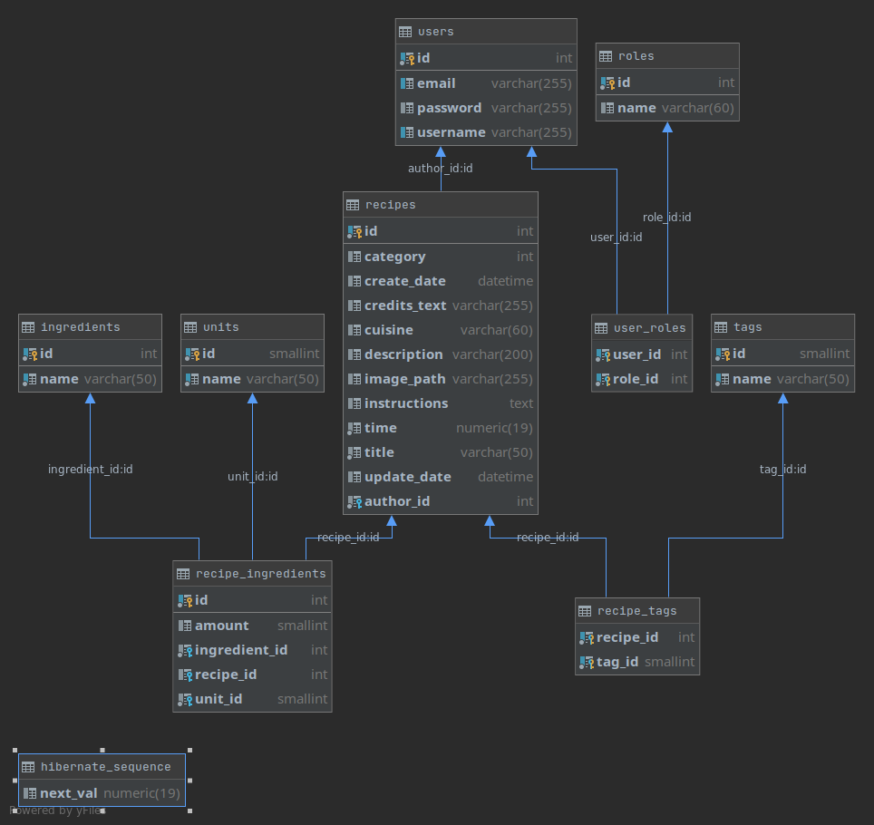

# Recipe App (Server side implementation) 
This is a personal project created for learning purposes. Here I 
build a Spring Boot Recipe application using Kotlin and Gradle. The 
database used is MariaDB. Other notable technologies: 
- [x] Hibernate
- [ ] MS Azure deployment (not yet done)
- [ ] Liquibase (not yet done) 
- [x] Trello Board for tracking progress (https://trello.com/b/z2fm1Jey/recip3-app)
- [x] GitHub Actions
- [x] Swagger UI 
- [x] SonarCloud (https://sonarcloud.io/dashboard?id=maxr96_Recipy-App-Server)
- [ ] and more soon...

# Main features of the API
   - [x] Upload and store recipes
   - [x] Get and extend possible measurement units
   - [x] Retrieve list of available ingredients
   - [ ] Search for recipes by ingredients
   - [x] Create and Login a user
   - [ ] Assign different user roles to the user (admin)
   - [ ] Get favourite recipes of the user
   - [ ] Get most recent and liked recipes
   - [ ] and more...
# Database Model
The main entities used for the database model:
- MeasurementUnit - stores the name of different units, e.g. gram, spoon.
- Ingredient - stores the name of different ingredients, e.g. black pepper, tomato.
- RecipeIngredient - stores the ingredient with its amount and measurement unit used in a recipe.
- Recipe - stores the actual recipe with title, description, ingredients, time it was posted and updated, time to prepare the recipe and author.
- User - stores the user of the website with their username, email and encrypted password.
- Roles - defines with roles can user have (for now there are three roles: USER, PM, ADMIN).

